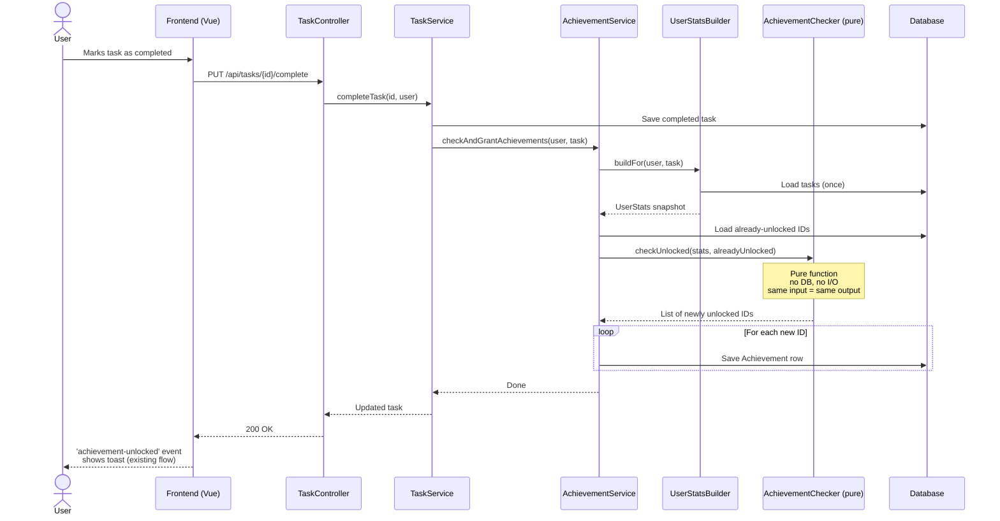
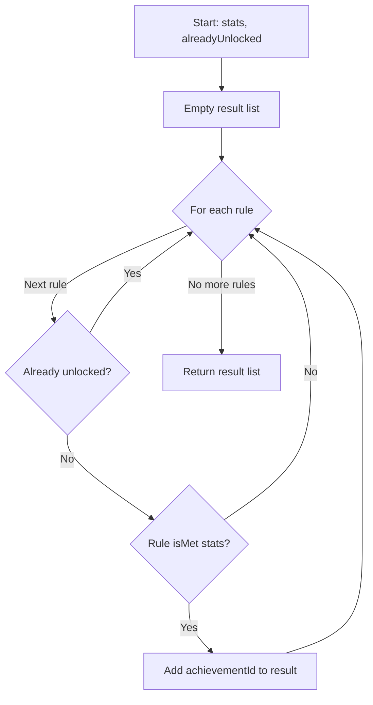
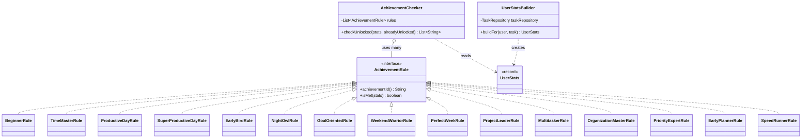

# Flow: Achievement Unlock Check

This file shows how the achievement check works when a user completes a task.

The check uses the **Strategy pattern**. Each achievement is its own rule class. A separate `UserStatsBuilder` is the only class that reads from the DB. The `AchievementChecker` is a pure function: same input → same output.

## Sequence Diagram

## Decision flow inside the checker

## Class structure (Strategy pattern)

## Why this is a pure function

- No DB reads or writes inside the checker — `UserStatsBuilder` does that once, separately.
- No notifications or side effects inside the checker — only returns a list.
- Same input always gives same output.
- Easy to test without mocks or a database.

## Why Strategy

- Adding a new achievement = a new class. No existing code is touched.
- Each rule is testable on its own.
- Spring auto-discovers all `@Component` rules and injects them as a list.
- See module README at `AchievementModule/README.md` for full rationale.
