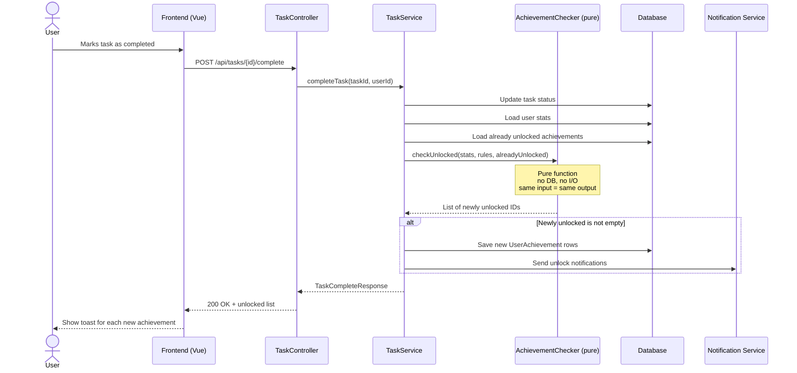
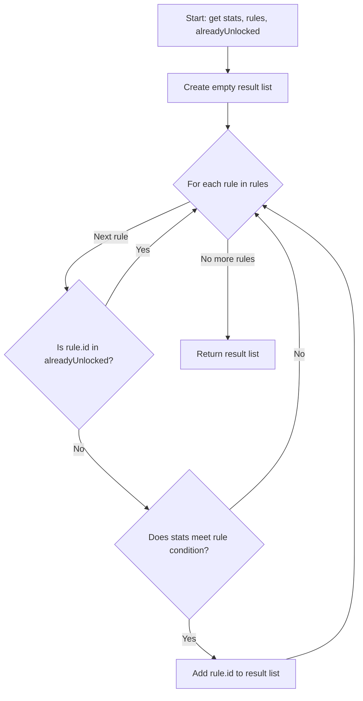

# Flow: Achievement Unlock Check

This diagram shows how the achievement check works when a user completes a task.

The actual unlock logic lives in a pure function. It only decides *which* achievements should be unlocked. Saving them to the database and notifying the user happens outside the function.

## Sequence Diagram

## Decision flow inside the pure function

## Why this is a pure function

- **No database reads or writes.** The caller passes in everything the function needs.
- **No notifications or side effects.** It only returns a list.
- **Same input always gives same output.** Calling it twice with the same arguments returns the same result.
- **Easy to test.** Any combination of stats and rules can be tested without setting up a database or mocks.
